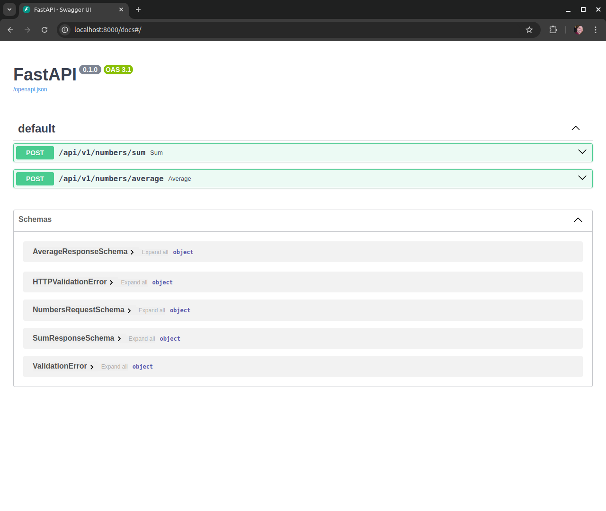

# Math FastAPI

Este projeto é uma API simples desenvolvida em [FastAPI](https://fastapi.tiangolo.com/), que expõe operações matemáticas básicas, como soma e média de uma lista de números. O projeto também utiliza Docker para facilitar a execução e desenvolvimento, além de MyPy para verificação de tipos.

## Funcionalidades

- Soma de uma lista de números
- Cálculo da média de uma lista de números

## Pré-requisitos

Para rodar o projeto, você precisa ter instalado:

- [Docker](https://www.docker.com/get-started)
- [Docker Compose](https://docs.docker.com/compose/install/)

## Instalação

1. Clone este repositório:

    ```bash
    git clonehttps://github.com/FelipeSoller/math_fastapi
    cd math_fastapi
    ```

2. Construa a imagem Docker:

    ```bash
    docker compose build
    ```

3. Inicie o container Docker:

    ```bash
    docker compose up
    ```

4. Acesse a API na URL:

    ```
    http://localhost:8000
    ```
5. Acesse a documentação (Swagger) na URL:

    ```
    http://localhost:8000/docs
    ```
    
    
    
## Uso

A API possui dois endpoints principais:

### `POST /api/v1/numbers/sum`

Este endpoint calcula a soma de uma lista de números.

#### Exemplo de Request:

```bash
curl -X 'POST' \
  'http://localhost:8000/api/v1/numbers/sum' \
  -H 'Content-Type: application/json' \
  -d '{
  "numbers": [1, 2, 3, 4]
}'
```

```json
{
  "sum": 10
}
```

### `POST /api/v1/numbers/average`

Este endpoint calcula a média de uma lista de números.

#### Exemplo de Request:

```bash
curl -X 'POST' \
  'http://localhost:8000/api/v1/numbers/average' \
  -H 'Content-Type: application/json' \
  -d '{
  "numbers": [2, 4, 6, 8]
}'
```

```json
{
  "average": 5.0
}
```

#### `Rodando Testes`

Para rodar os testes automatizados com `pytest`, você pode executar o seguinte comando dentro do container Docker:

```bash
docker compose exec web pytest
```

#### `Estrutura do Projeto`

```plaintext
├── src
│   ├── app
│   │   ├── controllers
│   │   │   └── api
│   │   │       └── v1
│   │   │           └── numbers_controller.py
│   │   ├── schemas
│   │   │   └── numbers_schemas.py
│   │   ├── services
│   │   │   └── math_services.py
│   │   └── main.py
│   └── tests
│       └── test_math_services.py
├── Dockerfile
├── docker-compose.yml
├── requirements.txt
├── ...
└── README.md

```

#### `Tecnologias Utilizadas`

* FastAPI
* Uvicorn
* MyPy
* Pytest
* Docker
